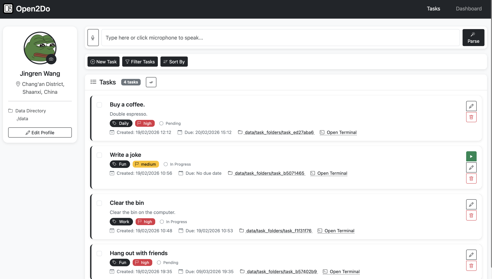
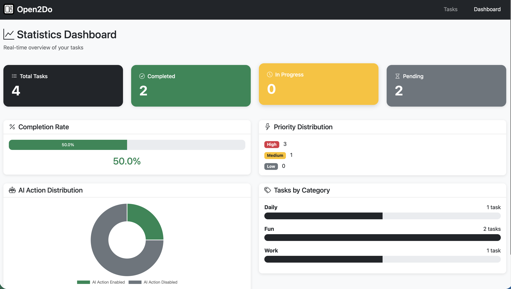

# Open2Do

A modern, feature-rich local web-based TODO application with AI-powered task execution and management.

[中文文档](README_CN.md)

<div align="center">
  
</div>

> [!NOTE]
> This project is built based on my own needs with the help of GLM-4.7. If you like it, you could modify it to fulfill your taste.

## Features

### Core Functionality
- **Clean, Modern UI**: Responsive web interface with dark theme built with Bootstrap CSS
- **Local Execution**: Runs entirely on `localhost:8000` - no cloud dependencies
- **Real-time Dashboard**: Statistical dashboard with auto-refresh every 10 seconds
- **JSON-based Storage**: Simple, database-free storage using JSON files

### Task Management
- **Full CRUD Operations**: Create, read, update, and delete tasks
- **Task Categories**: Organize tasks by category (Work, Personal, Shopping, etc.)
- **Priority Levels**: Low, Medium, and High priorities with visual indicators
- **Status Tracking**: Pending, In Progress, and Completed status
- **Due Date Support**: Set and display due dates with time precision
- **Created Date Tracking**: Automatically tracks when each task was created
- **Isolated Workspaces**: Each task gets its own folder in `data/task_folders/`

### Advanced Features
- **AI-Powered Execution**: Execute tasks using iFlow CLI with AI permission checking
- **AI Natural Language Autofill**: Parse natural language input to automatically fill forms (New Task, Filter Tasks, Sort By) with confirmation preview

> [!CAUTION]
> Although I have set permission checking, action such as accessing system files are dangerous, use at your own risk.

- **Permission Management**: AI analyzes if task execution requires modifying files outside the task folder
- **Bulk Operations**: Select multiple tasks for batch actions (enable/disable AI action, delete)
- **Drag-and-Drop Reordering**: Manually reorder tasks when using "Custom Order" sort mode
- **Advanced Filtering**: Filter by category, status, created date range, and due date range
- **Flexible Sorting**: Sort by created date, due date, priority, or custom manual order
- **Search Functionality**: Full-text search across task titles and descriptions
- **Folder Integration**: Click on task folder path to open it in system file explorer
- **Terminal Integration**: Click "Open Terminal" to launch a local terminal window directly in the task folder

> [!NOTE]
> The inplace-rendered terminal solution I tried does not have full functionality compared to a local shell. If you have better solution, feel free to launch a PR.

- **User Profile**: Customizable profile with avatar upload, name editing, and location detection
- **Configurable Data Directory**: Set custom storage location via environment variable

### Dashboard Analytics
- **Task Statistics**: Total tasks, completed, in progress, pending
- **Completion Rate**: Visual progress bar showing task completion percentage
- **Priority Distribution**: Breakdown by priority level
- **Category Breakdown**: Tasks per category with visual progress bars
- **AI Action Distribution**: Pie chart showing tasks with AI action enabled vs disabled

## Prerequisites

- Python 3.7 or higher
- pip (Python package manager)
- iFlow CLI (for AI-powered task execution)
- Modern web browser (Chrome, Firefox, Safari, Edge)

## Setup

### 1. Clone or Download the Repository

```bash
cd Open2Do
```

### 2. Create a Virtual Environment (Recommended)

```bash
python3 -m venv venv
source venv/bin/activate  # On Windows: venv\Scripts\activate
```

### 3. Install Dependencies

```bash
pip install -r requirements.txt
```

### 4. Configure Environment Variables (Optional)

Copy the example environment file:

```bash
cp .env.example .env
```

Edit `.env` to configure:

- `DATA_DIR` - Directory where task data will be stored (default: `./data`)
- `IFLOW_COMMAND` - Command to run iFlow (default: `iflow`)

## Launching the Application

### Quick Start (Using the provided script)

```bash
./start.sh
```

### Manual Start

```bash
source venv/bin/activate  # On Windows: venv\Scripts\activate
python -m uvicorn app.main:app --reload --host 127.0.0.1 --port 8000
```

The application will start and be available at: **http://localhost:8000**

## Using the Application

### Screenshots

<div align="center">
  <h3>Tasks Page</h3>
  
  
  <h3>Dashboard</h3>
  
</div>

### Navigation

Access the application through your web browser:
- **Tasks Page**: http://localhost:8000/ - Main task management interface
- **Dashboard**: http://localhost:8000/dashboard - Statistics and analytics

### User Profile

1. Click your avatar or "Edit Profile" button in the left sidebar
2. **Upload Avatar**: Click the camera button to upload a profile picture
3. **Edit Name**: Change your display name
4. **Set Location**: 
   - Click "Auto-detect Location" to use browser geolocation
   - Or manually type your location
5. **Configure Data Directory**: Set where task data is stored
6. Click "Save Changes"

### Creating Tasks

1. Click "New Task" button in the Quick Actions bar
2. Fill in the task form:
   - **Title** (required): Task name
   - **Category** (required): Task category (e.g., Work, Personal, Shopping)
   - **Priority**: Low, Medium, or High
   - **Due Date**: Date and time when the task is due
   - **Description**: Detailed task description
3. Click "Add Task"

A new isolated folder will be created in `data/task_folders/` for each task.

### Managing Tasks

#### Basic Operations
- **Edit Task**: Click the pencil icon to modify task details
- **Delete Task**: Click the trash icon to remove the task and its folder
- **Change Status**: Edit a task and change its status to "In Progress" or "Completed"

#### Selecting Tasks
- **Select Individual**: Click the checkbox next to any task
- **Select All**: Click the check-all icon in the task header
- **Bulk Actions Bar**: Appears when tasks are selected
  - **Enable/Disable AI Action**: Toggle AI execution buttons on selected tasks
  - **Delete Selected**: Delete all selected tasks at once

#### Task Execution with AI
1. **Enable AI Action**: Select tasks and click "Enable/Disable AI Action"
2. **Execute Button**: A green play button appears on enabled tasks
3. **Click Execute**: 
   - Shows warning about AI execution
   - AI checks if task needs permission to modify files outside folder
   - If permission needed: prompts for confirmation
   - Task executes via iFlow CLI
   - Status automatically set to "Completed"

### Filtering and Sorting

#### Quick Actions Bar
- **New Task**: Expand task creation form
- **Filter Tasks**: Expand filter options
- **Sort By**: Expand sort options

#### AI Natural Language Autofill
- **AI Input Box**: Type natural language commands or use voice input at the top of the Tasks page
- **Speech Recognition**: Click the microphone button to speak commands - real-time transcription as you speak
- **Parse**: Click "Parse" to analyze your input using iFlow CLI
- **Confirmation Preview**: Review detected form changes before applying
- **Auto-Expand**: Forms automatically expand when autofilled
- **Smart Detection**: Automatically identifies New Task, Filter, or Sort operations
- **Keyword Extraction**: Extracts keywords (2-5 words) for task titles, uses full sentences for descriptions

Examples:
- "Create a high priority work task about meeting tomorrow"
- "Show me pending tasks from the work category"
- "Sort tasks by due date"

> [!NOTE]
> Speech recognition requires microphone access and works best in Chrome or Edge browsers.

#### Filtering Options
- **Category**: Filter by task category
- **Status**: Filter by task status (Pending, In Progress, Completed)
- **Priority**: Filter by priority level (Low, Medium, High)
- **Search**: Full-text search in titles and descriptions
- **Created Date Range**: Filter by when tasks were created
- **Due Date Range**: Filter by due date
- **Clear Filters**: Reset all filters

#### Sorting Options
- **Custom Order**: Drag and drop to manually reorder tasks
- **Created Date**: Sort by when tasks were created (ascending/descending)
- **Due Date**: Sort by due date (ascending/descending)
- **Priority**: Sort by priority level (Low → Medium → High)

### Working with Task Folders

Each task has its own isolated workspace:
- **Folder Path**: Displayed on each task card
- **Click to Open**: Click the folder path to open it in your system's file explorer
- **Open Terminal**: Click "Open Terminal" to launch a local terminal window directly in the task folder
  - Automatically converts relative paths to absolute paths
  - Works across Windows, macOS, and Linux
  - Supports common terminal emulators (Terminal.app, cmd, gnome-terminal, etc.)
- **Storage**: Task-specific files and notes can be stored here

### Dashboard Analytics

The dashboard provides real-time insights:

#### Overview Cards
- **Total Tasks**: Total number of tasks
- **Completed**: Tasks marked as completed
- **In Progress**: Tasks currently being worked on
- **Pending**: Tasks waiting to be started

#### Visual Analytics
- **Completion Rate**: Progress bar showing percentage of completed tasks
- **Priority Distribution**: Breakdown by priority level
- **AI Action Distribution**: Pie chart showing AI-enabled vs disabled tasks
- **Category Breakdown**: Tasks per category with progress bars

The dashboard auto-refreshes every 10 seconds to show real-time updates.

## Data Storage

All data is stored in the configured `DATA_DIR` (default: `./data`):

- `tasks.json` - Task metadata, including AI button status and all task properties
- `task_folders/` - Individual task workspaces (one folder per task)
- `avatars/` - User profile avatar images
- `user_profile.json` - User profile information

You can change the data directory by setting the `DATA_DIR` environment variable in `.env`.

## iFlow Integration

### Prerequisites
Install iFlow CLI:
```bash
npm install -g iflow
```

### How It Works
- **Permission Check**: AI analyzes task description to determine if execution requires modifying files outside the task folder
- **Task Execution**: Tasks are executed through iFlow CLI with proper context
- **Fallback**: If iFlow is unavailable, execution is simulated with success message

### Configuring iFlow
The default command is `iflow`. You can customize this in `.env`:
```
IFLOW_COMMAND=/path/to/iflow
```

## Stopping the Application

Press `Ctrl+C` in the terminal where the application is running.

## Troubleshooting

### Port Already in Use
If port 8000 is already in use, specify a different port:
```bash
python -m uvicorn app.main:app --reload --host 127.0.0.1 --port 8001
```

### Import Errors
Ensure you're in the virtual environment:
```bash
source venv/bin/activate
```

### AI Execution Not Working
- Verify iFlow CLI is installed and accessible
- Check the iFlow command path in `.env`
- Check browser console for error messages

### Tasks Not Appearing
- Refresh the page
- Check browser console for JavaScript errors
- Verify `data/tasks.json` exists and is valid JSON

### Dashboard Not Updating
- The dashboard auto-refreshes every 10 seconds
- Manually click the "Refresh Dashboard" button to force an update

## Project Structure

```
Open2Do/
├── app/
│   ├── main.py              # FastAPI application and API endpoints
│   ├── models.py            # Pydantic data models
│   ├── storage.py           # JSON storage handler with user profile support
│   ├── ai_scheduler.py      # iFlow CLI integration for AI operations
│   ├── static/
│   │   ├── css/
│   │   │   └── styles.css   # Custom styling with dark theme
│   │   ├── js/
│   │   │   ├── app.js       # Main page JavaScript
│   │   │   └── dashboard.js # Dashboard JavaScript with Chart.js
│   │   └── o2dologo.png     # Application logo
│   └── templates/
│       ├── index.html       # Tasks page with collapsible sections
│       └── dashboard.html   # Statistics dashboard
├── data/                    # User data directory
│   ├── tasks.json           # Task storage
│   ├── task_folders/        # Individual task workspaces
│   ├── avatars/             # User avatar images
│   └── user_profile.json   # User profile data
├── requirements.txt         # Python dependencies
├── .env.example            # Environment configuration template
└── start.sh                # Startup script
```

## Keyboard Shortcuts (Tips)
- Use Tab to navigate between form fields
- Press Enter to submit forms
- Use arrow keys to navigate dropdown options
- Press Esc to close modals

## Best Practices
- **Categories**: Use descriptive category names for better organization
- **Priorities**: Reserve "High" priority for urgent tasks
- **AI Action**: Enable AI action only for tasks ready for automated execution
- **Backups**: Regularly back up the `data` directory to prevent data loss
- **Task Folders**: Store task-related files and notes in their designated folders

## License

MIT.